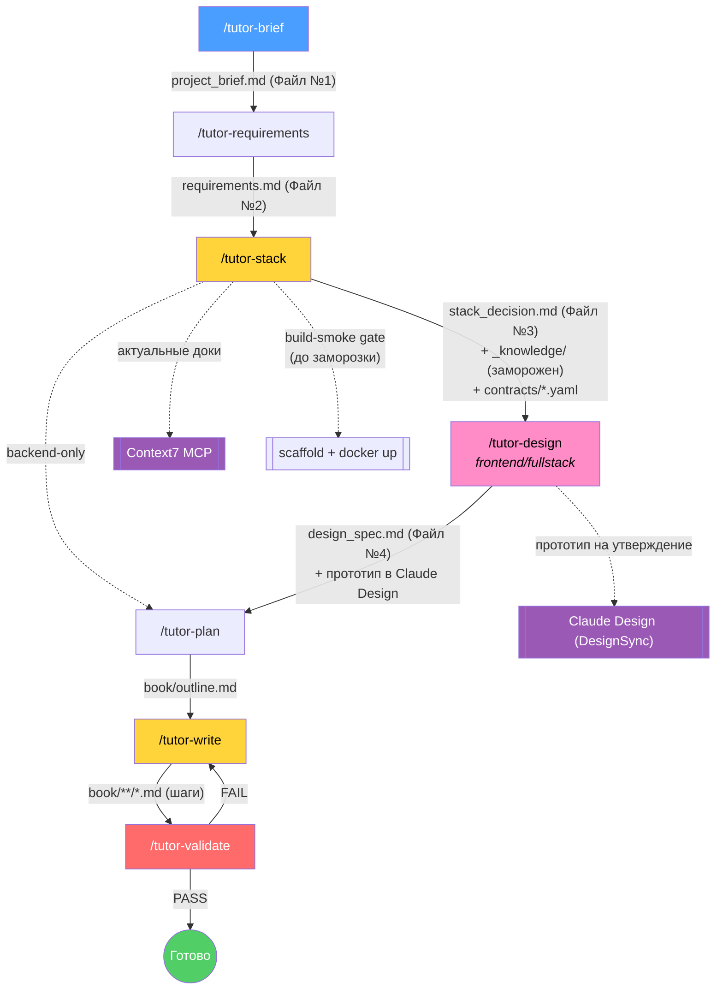

<p align="center">
  <strong>code-tutor</strong><br>
  <em>Генератор обучающих книг по разработке: от пустой папки до прод-стенда — на любом стеке</em>
</p>

<p align="center">
  
  
  
  
</p>

---

> **code-tutor** превращает идею проекта в **пошаговую книгу-туториал**, по которой новичок своими руками строит приложение — от установки окружения до деплоя на прод.
>
> Стек **не зашит**: backend, frontend или fullstack на любом языке/фреймворке (Python/Go/Java/Node + React/Vue/…). ИИ либо берёт стек из вашего описания, либо предлагает обоснованный сам.
>
> Для проектов с интерфейсом отдельный шаг **`/tutor-design`** проектирует все экраны и дизайн-систему (Файл №4 `design_spec.md`) и собирает **визуальный прототип в Claude Design** на утверждение — поэтому книга строит **полноценный UI** (все экраны, переходы, формы, состояния, стили), а не белую страницу.
>
> Ключевой принцип — **код без объяснения запрещён**: после каждого блока кода идёт «Разбор кода» и «Под капотом». Глубина и отсутствие галлюцинаций держатся на **замороженной базе знаний под выбранный стек** (Stack Knowledge Pack), собираемой из актуальных доков через **Context7**. Перед заморозкой `/tutor-stack` прогоняет **build-smoke gate**: собирает по паку минимальный скаффолд и реально запускает (install/typecheck/test; для fullstack — `docker compose up` + проверка трёх слоёв) — версионные и упаковочные дефекты ловятся до написания книги.

---

## Содержание

- [Быстрый старт](#-быстрый-старт)
- [Процесс (пайплайн)](#-процесс-пайплайн)
- [Доступные команды](#-доступные-команды)
- [Артефакты пайплайна](#-артефакты-пайплайна)
- [Ключевые абстракции](#-ключевые-абстракции)
- [Навыки](#-навыки)
- [Структура репозитория](#-структура-репозитория)
- [Применение на практике](#применение-на-практике)
- [Context7 MCP](#-context7-mcp)
- [Claude Design (прототип UI)](#-claude-design-прототип-ui)

---

## ⚡ Быстрый старт

code-tutor — это набор **команд** (`/tutor-*`) и **навыков** для Claude Code, лежащих в `.claude/`. Два способа использовать:

**A. Работать прямо в этом репозитории** (книга генерируется в `book/`):

```bash
git clone https://github.com/boboden541/code-tutor.git
cd code-tutor
```

**B. Подключить инструментарий к своему проекту** — скопировать управляемые папки и MCP-конфиг:

```bash
git clone --depth 1 https://github.com/boboden541/code-tutor.git /tmp/code-tutor
cp -R /tmp/code-tutor/.claude/commands ./.claude/commands
cp -R /tmp/code-tutor/.claude/skills   ./.claude/skills
cp    /tmp/code-tutor/.mcp.json         ./.mcp.json
cp    /tmp/code-tutor/.claude/settings.json ./.claude/settings.json   # пред-одобрение Context7
rm -rf /tmp/code-tutor
```

> **После установки перезагрузите IDE** (Reload Window), чтобы команды `/tutor-*` появились в чате, а MCP-сервер `context7` подключился.

Затем запустите цепочку (по одному шагу):

```text
/tutor-brief Хочу fullstack «список задач»: пользователи, проекты, задачи. Бэкенд + веб-интерфейс.
/tutor-requirements
/tutor-stack
/tutor-design            # только для frontend/fullstack: экраны + дизайн-система + прототип
/tutor-plan
/tutor-write
/tutor-validate
```

> Для **backend-only** проектов шаг `/tutor-design` пропускается — после `/tutor-stack` сразу `/tutor-plan`.

---

## 🔄 Процесс (пайплайн)



**Идея:** требования (что строим) отделены от стека (на чём строим), а стек — от интерфейса (как выглядит). `/tutor-stack` выбирает стек, резолвит профиль, прогоняет build-smoke gate и **замораживает** базу знаний; `/tutor-design` (для UI-проектов) фиксирует экраны и дизайн-систему. Дальше книга пишется строго против пака и спецификации — воспроизводимо, без галлюцинаций и без «белых страниц».

---

## 🛠 Доступные команды

| Команда | Навык | Описание | Результат |
|:--------|:------|:---------|:----------|
| `/tutor-brief` | project-brief | Идея → бриф (тип проекта, домен, сценарии; стек опционален) | `project_brief.md` |
| `/tutor-requirements` | requirements-interview | Опросник FR/UR/IR/NFR (стек-агностично) | `requirements.md` |
| `/tutor-stack` | stack-advisor | Выбор/предложение стека, профиль, **build-smoke gate + заморозка пака**, контракт | `stack_decision.md`, `book/_knowledge/`, `book/contracts/` |
| `/tutor-design` | ui-designer | *(frontend/fullstack)* экраны + дизайн-система + прототип в Claude Design | `design_spec.md`, проект «… UI» в Claude Design |
| `/tutor-plan` | book-architect | План книги по профилю (для fullstack — 2 трека; фронт — по экранам из `design_spec`) | `book/outline.md` |
| `/tutor-write` | book-author | Запись шагов против пака (идемпотентно, возобновляемо) | `book/**/*.md` |
| `/tutor-validate` | book-architect | Проверка целостности (стек-aware, только чтение) | отчёт PASS/FAIL |

---

## 📦 Артефакты пайплайна

| Артефакт | Создаёт | Что внутри |
|:---------|:--------|:-----------|
| **Файл №1** `project_brief.md` | `/tutor-brief` | Цель, **тип проекта** (backend/frontend/fullstack), домен, сценарии, профиль читателя; стек — опционально |
| **Файл №2** `requirements.md` | `/tutor-requirements` | Требования по 4 категориям с дефолтами ИИ |
| **Файл №3** `stack_decision.md` | `/tutor-stack` | Утверждённый стек + версии + обоснования, резолв профиля(ей), индекс пака |
| **Knowledge Pack** `book/_knowledge/<tech>/` | `/tutor-stack` | Замороженная база знаний под стек (источник истины для записи) |
| **Контракт** `book/contracts/<domain>.yaml` | `/tutor-stack` | OpenAPI 3.0.3 — шов фронт↔бэк |
| **Файл №4** `design_spec.md` | `/tutor-design` | *(frontend/fullstack)* все экраны (маршрут, роль, вызовы API, формы+валидация, состояния, навигация) + дизайн-система (токены/компоненты/тон) |
| **План** `book/outline.md` | `/tutor-plan` | Машиночитаемый план (части → главы → секции → шаги) |
| **Книга** `book/**` | `/tutor-write` | Сами шаги-уроки с полным кодом и разборами |

---

## 🧠 Ключевые абстракции

| Абстракция | Зачем | Где |
|:-----------|:------|:----|
| **Architecture Profile** | Декларативный профиль на технологию: порядок слоёв фичи, скелет глав, файл-снимок состояния, тест-раннер, деплой. Делает план стек-независимым | `.claude/skills/book-architect/resources/profiles/` |
| **Stack Knowledge Pack** | Замораживаемая база знаний под выбранные библиотеки. Переносит «единый источник истины, без галлюцинаций» на любой стек | `book/_knowledge/<tech>/` |
| **API Contract (OpenAPI)** | Генерится *вперёд* из требований. Бэк реализует ровно его, фронт строит типы ровно под него | `book/contracts/` |
| **Design Spec + дизайн-система** | *(frontend/fullstack)* все экраны выводятся из контракта+требований; токены/компоненты задаются один раз. Каждый эндпоинт потребляется ≥1 экраном — нет «недостижимых» функций и белых страниц | `design_spec.md`, `ui-designer/` |
| **Build-smoke gate** | До заморозки пака — сборка скаффолда и реальный запуск (install/typecheck/test; fullstack — `docker compose up` + три слоя). Ловит версионные/упаковочные дефекты до книги | `stack-advisor/resources/build_smoke_gate.md` |

**Профили из коробки:** `backend_layered` (FastAPI/Spring/Nest/Go…), `frontend_spa` (React/Vue/Svelte…; слои `api_client→store→hooks→components→styles`, стилизация — токены + CSS Modules), `_generic_template` (заполняется для экзотики).

**Стандарт подачи (убывающая детализация):** 1-я фича — один слой = один шаг с полным кодом и разбором; 2-я — слои сгруппированы; 3-я+ — «по образцу со ссылкой». Каждая фича = ветка `feat/*` = Merge Request (в **каждой** части — и backend, и frontend).

---

## 📂 Навыки

Каждый навык содержит **SKILL.md** (ролевая модель + принципы), **resources/** (стандарты, профили, чек-листы), **examples/** (шаблоны-эталоны).

| Навык | Назначение |
|:------|:-----------|
| `project-brief/` | Идея → структурированный бриф (Файл №1) |
| `requirements-interview/` | Бриф → опросник требований (Файл №2) |
| `stack-advisor/` | Выбор стека, резолв профиля, сборка Knowledge Pack, build-smoke gate, генерация контракта (Файл №3) |
| `ui-designer/` | *(frontend/fullstack)* экраны + дизайн-система + прототип в Claude Design (Файл №4) |
| `book-architect/` | Проектирование плана книги + чек-лист валидации + профили архитектуры |
| `book-author/` | Написание шагов книги против пака (полный код + «Разбор кода» + «Под капотом») |

---

## 🗂 Структура репозитория

```
code-tutor/
├── .claude/
│   ├── commands/                 ← 7 команд /tutor-*
│   ├── skills/                   ← 6 навыков (роли + ресурсы + эталоны)
│   │   ├── project-brief/
│   │   ├── requirements-interview/
│   │   ├── stack-advisor/        ← resources/build_smoke_gate.md — gate до заморозки
│   │   ├── ui-designer/          ← resources/ — схема экрана, дизайн-система, прототип
│   │   ├── book-architect/       ← resources/profiles/ — профили архитектуры
│   │   └── book-author/
│   └── settings.json             ← пред-одобрение MCP context7
├── .mcp.json                     ← MCP-сервер context7 (актуальные доки библиотек)
├── project_brief.md              ← Файл №1 (пример: Personal Finance Assistant)
├── requirements.md               ← Файл №2
├── design_spec.md                ← Файл №4 (для frontend/fullstack)
└── book/                         ← сгенерированная книга
    ├── outline.md                ← план (контракт для /tutor-write)
    ├── _knowledge/               ← Stack Knowledge Pack (заморожен)
    ├── contracts/                ← API-контракты OpenAPI
    └── chapter_*/section_*/NN_*.md
```

> Эталонный прогон всего пайплайна (fullstack-маркетплейс подарков на FastAPI + React, с дизайном и Docker) лежит в [`_testrun/giftmarket/`](_testrun/giftmarket/) — со своим `README.md` и `TEST_REPORT.md`.

---

# Применение на практике

### Backend на Python (стек задан)

```text
/tutor-brief Сервис заметок с тегами и пользователями. Стек: FastAPI, PostgreSQL, SQLAlchemy, JWT, Docker, GitLab CI.
/tutor-requirements          # принять дефолты ИИ или дозаполнить
/tutor-stack                 # подтвердит стек, соберёт пак из доков (Context7), сгенерит контракт
/tutor-plan                  # план книги по профилю backend_layered
/tutor-write                 # пишет шаги; запускайте повторно — допишет оставшиеся
/tutor-validate              # PASS/FAIL
```

### Fullstack (стек предлагает ИИ)

```text
/tutor-brief Fullstack «трекер привычек»: пользователи, привычки, отметки выполнения, статистика. Бэкенд + веб-интерфейс. Стек на ваше усмотрение.
/tutor-requirements
/tutor-stack                 # предложит, напр., FastAPI + React; профили backend_layered + frontend_spa; контракт OpenAPI; build-smoke gate
/tutor-design                # экраны + дизайн-система; прототип в Claude Design на утверждение → design_spec.md
/tutor-plan                  # две части: part_1_backend / part_2_frontend, контракт-first срезы; фронт — по экранам из design_spec
/tutor-write 5               # написать 5 ближайших шагов за вызов
/tutor-validate
```

> **Возобновляемость и идемпотентность:** `/tutor-write` пишет только незавершённые шаги (`[ ]`) и никогда не перезаписывает готовые (`[x]`). Запускайте сколько угодно раз.

---

## 🔌 Context7 MCP

`/tutor-stack` собирает Knowledge Pack из **актуальной документации библиотек** через [Context7](https://github.com/upstash/context7). Сервер уже сконфигурирован в репозитории:

- `.mcp.json` — сервер `context7` (`npx -y @upstash/context7-mcp`)
- `.claude/settings.json` — `enabledMcpjsonServers: ["context7"]` (подключается без ручного подтверждения)

**Как используется:** для каждой ключевой библиотеки стека — `resolve-library-id` → `get-library-docs` (под нужную версию), происхождение фактов помечается в паке (`source: context7:<id>`).

> **Fallback:** если Context7 недоступен (headless/cron/сервер не поднялся) — `/tutor-stack` берёт факты из WebSearch/WebFetch и помечает это в индексе пака. Книга соберётся в любом окружении.

Проверить подключение: команда `/mcp` (должен быть `context7` → connected). API-ключ не обязателен (работает с базовыми лимитами); для больших лимитов можно добавить `--api-key` в `.mcp.json`.

---

## 🎨 Claude Design (прототип UI)

Для frontend/fullstack `/tutor-design` не только пишет `design_spec.md`, но и собирает **визуальный прототип**, чтобы вы увидели интерфейс **до** написания книги:

- **основная поверхность — Claude Design** (claude.ai/design) через инструмент **DesignSync**: создаётся проект «<Проект> UI», экраны/компоненты пушатся туда карточками, вы смотрите и утверждаете;
- **fallback — Artifact**: если design-доступ недоступен в сессии (headless/cron), прототип публикуется как self-contained HTML-страница; если недоступно и это — отдаётся `design_spec.md` с явной пометкой.

> Эстетика **выводится из сути продукта** (через навык `frontend-design`), а не из пресета. Стилизация по умолчанию — дизайн-токены + CSS Modules (без новых зависимостей, чтобы не ломать build-smoke gate). Если экран требует данных, которых нет в контракте, `/tutor-design` отправляет назад в `/tutor-stack` — расширять контракт/бэкенд, а не рисовать заглушки.

---
